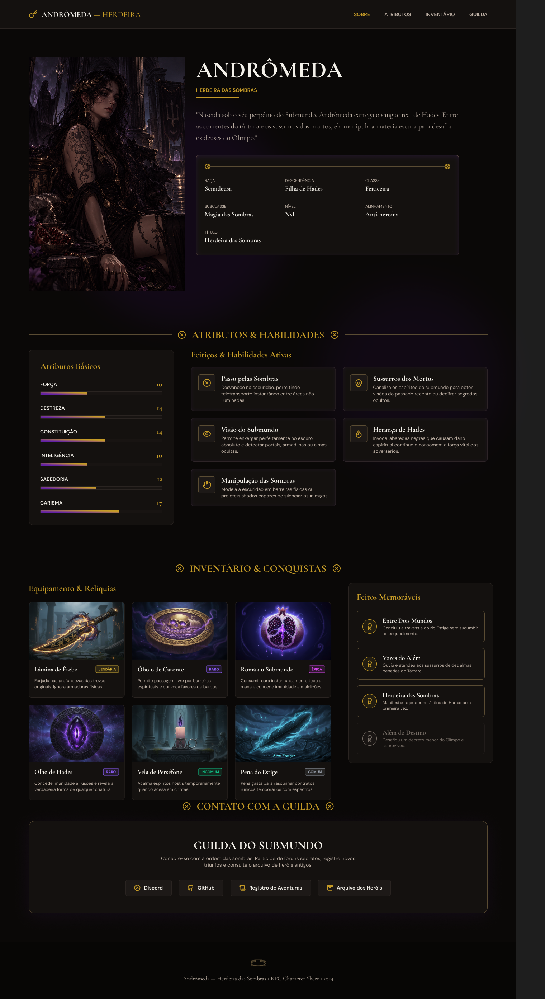

    # 📁 Portfólio Pessoal - Front-End 

Este é meu projeto final desenvolvido durante o curso **Tecnologia Web - Engenharia da Computação (Front-End)**. Trata-se de um site de uma ficha de personagem de RPG, e formas de contato.

---

## 📌 Sobre o Projeto

Este site foi criado com foco em aplicar os conhecimentos de **HTML**, **CSS**,, **Flexbox**, **responsividade** e **publicação com GitHub Pages**.

---

## 🧰 Tecnologias Utilizadas

- HTML5
- CSS3 + Flexbox
- Google Fonts
- Font Awesome
- Git + GitHub
- GitHub Pages (para publicação)

---

## 🎨 Protótipo (Figma)

Link para o protótipo criado no Figma:  
[🔗 Ver protótipo](https://www.figma.com/proto/PniRbYbXVgz3ilxScx6Ln7/Sem-t%C3%ADtulo?node-id=0-1&t=SKAVttSR346JGSTN-1)

---

## 🔗 Acesso ao Projeto

- **GitHub Pages:** [Clique aqui para acessar o site](https://juliadias-dev.github.io/andromeda/)
- **Repositório GitHub:** [Acesse o código-fonte aqui](https://github.com/juliadias-dev/andromeda)
---

## 📸 Capturas de Tela

> 

---

## 📄 Licença

Este projeto é de uso educacional, criado como parte da disciplina **Tecnologia Web**.

---

## 🙋‍♀️ Desenvolvido por

**Julia Ribeiro Dias RA:266518**  
Turma: [Engenharia da computação 2 semestre]  
Email: [jd266518@alunos.unisanta.br]  
GitHub: [https://github.com/seuusuario](https://github.com/juliadias-dev)